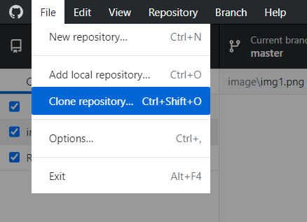
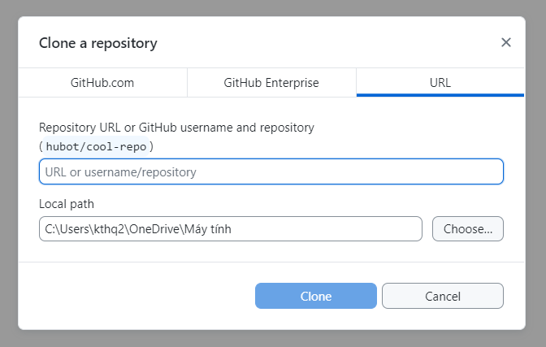
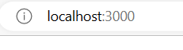

# môi trường
node.js
## hướng dẫn tải code về máy 
- vào gitdesktop
- chọn file, chọn "clone a repository" 

- chọn URL và paste đường dẫn "https://github.com/Quinne2002/quyenne123.git", chọn nơi bạn muốn lưu trữ code và ấn "Clone" 

### hướng dẫn chạy code 
- bật project, chọn open in Intergrated terminal
- cài đặt node modules: npm i (lưu ý kiểm tra xem đã trỏ đúng vào project chưa)
- chạy code server: npm start
- truy cập vào http://localhost:3000 

